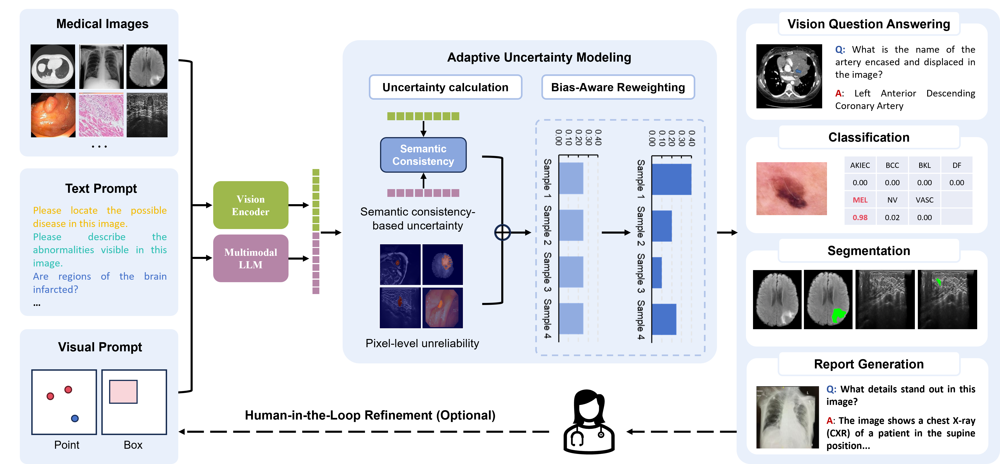

# BiasCareVL: Bias-constrained multimodal intelligence for equitable and reliable clinical AI

## Overview
The integration of medical imaging and clinical text has enabled the emergence of generalist artificial intelligence (AI) systems for healthcare. However, pervasive biases, such as imbalanced disease prevalence, skewed anatomical region distributions, heterogeneous imaging protocols, and demographic disparities, pose significant challenges to the fairness and reliability of vision-language systems in real-world clinical settings. Here we present BiasCareVL, a bias-aware multimodal learning framework that introduces bias control directly into model design, rather than treating it as a post hoc correction.



BiasCareVL incorporates adaptive uncertainty modeling with optional human-in-the-loop refinement to regulate the influence of dominant data patterns and to promote equitable reasoning under distributional imbalance. Trained on 3.44 million samples spanning over 15 imaging modalities, the framework supports diverse clinical tasks, including visual question answering, disease classification, segmentation, and report generation within a unified representation space. Across eight public benchmarks covering dermatology, oncology, radiology, and pathology, BiasCareVL consistently outperforms 20 state-of-the-art methods, with pronounced gains in clinically challenging scenarios, including over 10% accuracy improvement in multi-class skin lesion diagnosis and more than 20% Dice improvement in small tumor segmentation. Furthermore, BiasCareVL achieves diagnostic performance exceeding human accuracy with substantially reduced time requirements when evaluated with board-certified radiologists.

<!---## Datasets
1. [PubMedVision](https://huggingface.co/datasets/FreedomIntelligence/PubMedVision)
2. [IMed-361M](https://huggingface.co/datasets/General-Medical-AI/IMed-361M)
3. [MIMIC-CXR v2](https://physionet.org/content/mimic-cxr-jpg/2.0.0/)
4. [PMC-VQA](https://huggingface.co/datasets/RadGenome/PMC-VQA)
5. [VQA-RAD](https://huggingface.co/datasets/flaviagiammarino/vqa-rad)
6. [PathVQA](https://huggingface.co/datasets/flaviagiammarino/path-vqa)
7. [CXR-LT2024](https://physionet.org/content/cxr-lt-iccv-workshop-cvamd/1.1.0/)
8. [ISIC2018](https://challenge.isic-archive.com/data/#2018)
--->

## Get Started

### Installation

```bash
git clone https://github.com/lich0031/BiasCareVL
cd BiasCareVL

python -m venv .venv
source .venv/bin/activate

pip install -r requirements.txt
```

### Requirements

- Linux is recommended.
- Python `3.10` is recommended.
- NVIDIA GPU(s) with CUDA support are recommended for practical use.
- Main dependencies are listed in [`requirements.txt`](./requirements.txt), 

### Checkpoints and paths

Before running the code, update local paths as needed. In particular, check:

- `--version`
- `--vision_pretrained`
- `--dataset_dir`

Released checkpoints are available at:

- `BiasCareVL weights`: [Google Drive](https://drive.google.com/drive/folders/1QX7sxmBg3OJjcx2u1vGDWTo_pShbF3lq?usp=drive_link)


### Datasets

The codebase references the following public datasets:

- `PubMedVision`: [Link](https://huggingface.co/datasets/FreedomIntelligence/PubMedVision)
- `IMed-361M`: [Link](https://huggingface.co/datasets/General-Medical-AI/IMed-361M)
- `MIMIC-CXR-JPG v2.0.0`: [Link](https://physionet.org/content/mimic-cxr-jpg/2.0.0/)
- `PMC-VQA`: [Link](https://huggingface.co/datasets/RadGenome/PMC-VQA)
- `VQA-RAD`: [Link](https://huggingface.co/datasets/flaviagiammarino/vqa-rad)
- `PathVQA`: [Link](https://huggingface.co/datasets/flaviagiammarino/path-vqa)
- `CXR-LT 2024`: [Link](https://physionet.org/content/cxr-lt-iccv-workshop-cvamd/1.1.0/)
- `ISIC 2018`: [Link](https://challenge.isic-archive.com/data/#2018)

Please download the datasets you need and organize them according to the directory structure expected by:

- [`utils/refer_seg_dataset.py`](./utils/refer_seg_dataset.py)
- [`utils/vqa_dataset_trainsplit.py`](./utils/vqa_dataset_trainsplit.py)

### Training and Inference

Training and inference commands are provided in [`cmd.sh`](./cmd.sh).

Please update local checkpoint and dataset paths in that file before running.

Expected inference outputs are written under `./runs/<exp_name>/`:

- `cls_metrics.json`
- `dir_metrics.json`
- `visualization/`
- `results/*.json`


## Feedback and Contact

For questions about the code release, please replace this section with the project contact email, issue tracker, or corresponding author information.

## License

This project is released under the license in [`LICENSE`](./LICENSE).

## Acknowledgement

This repository builds on or includes components related to:

- `HuatuoGPT-Vision`
- `Qwen2.5-VL`
- `SAM`
- `IMIS`

You can expand this section with specific upstream repositories or acknowledgements as needed.

## Citation

If you find this repository useful, please consider citing:

```bibtex
@article{biascarevl,
  title   = {Bias-constrained multimodal intelligence for equitable and reliable clinical AI},
  author  = {Author Placeholder},
  journal = {Journal Placeholder},
  year    = {Year Placeholder}
}
```
